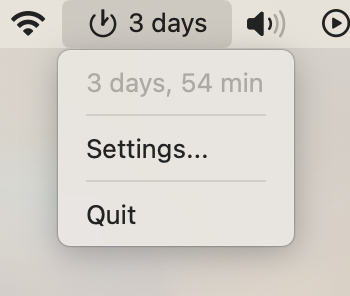

# Remember Restart for mac

| Menu                              | Settings                              |
| --------------------------------- | ------------------------------------- |
|  |  |

## Welcome to Remember Restart for mac

Keeping your Mac running smoothly requires regular maintenance, and one of the simplest yet most effective actions you can take is to restart your Mac periodically.
Remember Restart for mac is here to ensure that you never forget this crucial step.

## Why Remember Restart for mac?

**Enhanced Performance:** Prolonged usage without restarts can lead to memory leaks, sluggishness, and unexpected application behavior. Our tool gently reminds you to restart your Mac at intervals you set, helping maintain its speed and reliability.

**Seamless Background Operation:** Designed to be unobtrusive, Remember Restart lives quietly in your menu bar. It monitors your Mac's uptime without interrupting your workflow, so you can focus on what's important.

**Startup Time at a Glance:** Ever wonder how long your Mac has been running since the last restart? Our app provides this information directly on the menu bar, giving you a quick and easy way to check your Mac's uptime.

**Customizable Notifications:** You're in control of when and how you receive restart reminders. Set your preferred intervals, ensuring they fit perfectly into your schedule.
